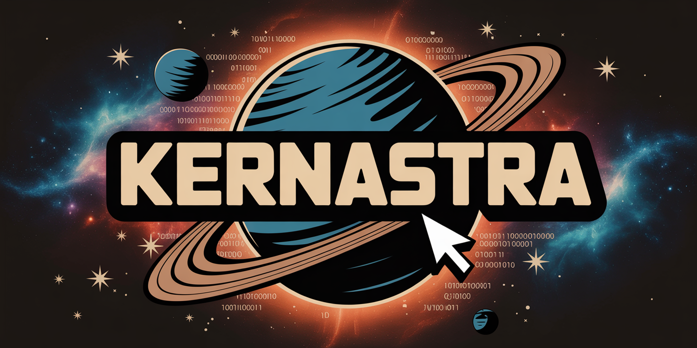

# Sean
🧰 I build tools, apps, and services with a focus on performance and clean UI.

🌌 Obsessed with retro space themes, automation, and open-source dev.

---

## 🧠 Summary

Creative, self-driven, and self-taught full-stack developer. I have a passion for automation, self-hosted infrastructure, and generative AI tools. AI has given me the desire and motivation to build programs that can help solve problems that come up in my life, and maybe someone elses too.

---

## 🔍 Interests

- DevOps + homelab automation  
- AI-assisted development workflows  
- Open-source dashboards and tools  
- Media libraries and streaming infrastructure  

---

## 📊 GitHub Stats

  
  

---

## Support Me

